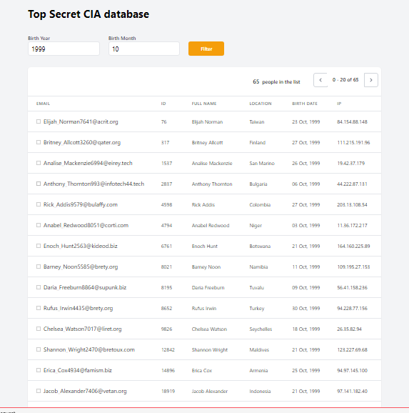

# laradata
A test app to show/filter data, using laravel, prosgres, redis

## Requirements

- nginx/apache
- php7.4+
- postgreSQL
- redis
- composer
- git

## Installation

- git clone <repo url> && cd [project directory]/
- composer install
- write db credential in `.env` file following `.env.example`
- place `test-data.csv` inside database/seeders/seeds/ directory then rename to `users.csv`.
- php artisan migrate --seed
- php artisan key:generate
- php artisan serve

## Output Snap

## License

This Laravel Application is open-sourced software licensed under the [MIT license](https://opensource.org/licenses/MIT).
